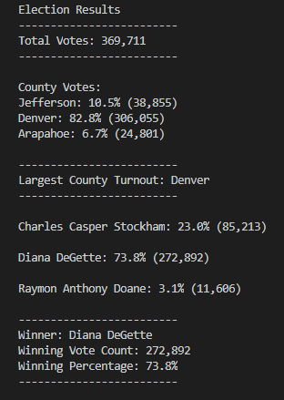

# Election_Analysis

## Project Overview
A Colorado Board of Elections employee has given you the following tasks to complete the election Audit of a recent local congressional election.

1. Calculate the total number of votes cast.
2. Get a complete list of candidates who received votes.
3. Calculate the total number of votes each candidate received.
4. Calculate the percentage of votes each candidate won.
5. Determine the winner of the election based on popular vote.

## resources
- Data Source: election_results.csv
- Software: Python 3.7.7, 

## Summary
The analysis of the election show that:
- There were "369,711" votes cast in the election.
- The candidates were:
    - Charles Casper Stockham
    - Diana DeGette
    - Raymon Anthony Doane
- The candidate results were:
    - Charles Casper Stockham received "23.0%" of the vote and "85,213" number of votes.
    - Diana DeGette received "73.8%" of the vote and "272,892" number of votes.
    - Raymon Anthony Doane received "3.1%" of the vote and "11,606" number of votes.
- The winner of the election was:
    - Candidate (Diana DeGette), who received "73.8%" of the vote and "272,892" number of votes.
    
## Challenge Overview
The election commission has requested some additional data to complete the audit:

1. The voter turnout for each county
2. The percentage of votes from each county out of the total count
3. The county with the highest turnout

## Challenge Summary
The analysis of the election show that:
- There were "369,711" votes cast in the election.
- Counties that took part in the election were: 
    - Arapahoe
    - Denver
    - Jefferson
- County results were:
    - Total votes cast in Arapahoe were 38,855, at 10.5% of total votes.
    - Total votes cast in Denver were 306,055, at 82.8% of total votes.
    - Total votes cast in Jefferson were 24,801, at 6.7% of total votes.
- Largest County Turnout was Denver
- The candidates were:
    - Charles Casper Stockham
    - Diana DeGette
    - Raymon Anthony Doane
- The candidate results were:
    - Charles Casper Stockham received "23.0%" of the vote and "85,213" number of votes.
    - Diana DeGette received "73.8%" of the vote and "272,892" number of votes.
    - Raymon Anthony Doane received "3.1%" of the vote and "11,606" number of votes.
- The winner of the election was:
    - Candidate (Diana DeGette), who received "73.8%" of the vote and "272,892" number of votes.
    
## Screenshot of the results are shown below:
### Output to Terminal

### Output to File

## Future Proposal
I would like to propose the following changes to the script, so that we could use the program for other elections in the state.
  - We could prompt user for inputting the name of the file to analyze rather than hardcoding the name in the python program.
  - We could also change the code to read the input folder for all election files, analyze each file at a time, and output the results' files into output folder with a name corresponding to the read input file, so the results can be found easily.
  - We could combine both of these into a menu option, where one option will let the user to manually enter a filename to process, and another option to enter a folder that has input files to process.
  
By doing the above modifications any election file that has the above CSV structure could be processed and a corresponding results file could be generated.
